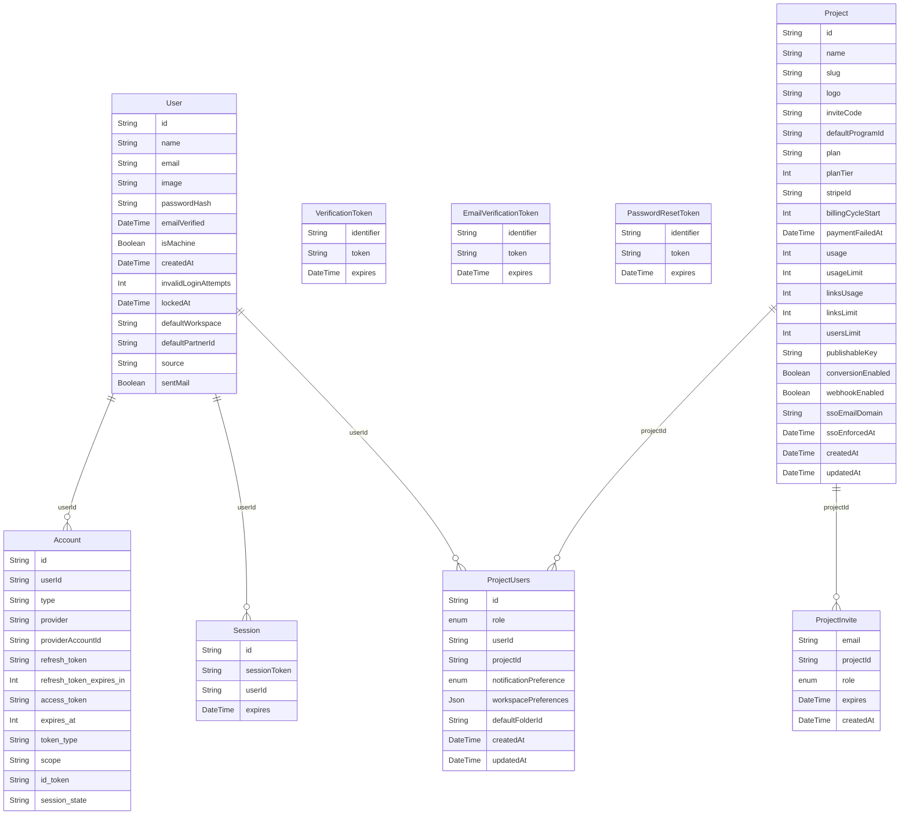

# 核心认证与 Workspace ER 图

只保留注册、登录、邮箱验证、重置密码、加入 workspace 这条主线里的核心表。

## 图例

- `||`：恰好 1 个
- `o{`：0 到多个

例如：

- `User ||--o{ Account`
  - 1 个 `User` 可以对应 0 到多个 `Account`

- `Project ||--o{ ProjectUsers`
  - 1 个 `Project` 可以对应 0 到多个 `ProjectUsers`

## 怎么理解

- `User`
  - 账号主体

- `Account`
  - 第三方登录账号映射，例如 GitHub、Google

- `Session`
  - 登录成功后的会话记录

- `VerificationToken`
  - 邮件链接类验证，例如邀请链接、邮箱变更确认

- `EmailVerificationToken`
  - 注册时 6 位 OTP 验证码

- `PasswordResetToken`
  - 忘记密码时的一次性重置凭证

- `Project`
  - 也就是 workspace

- `ProjectUsers`
  - 用户和 workspace 的中间表
  - 表示“这个用户在这个 workspace 里是什么角色”

- `ProjectInvite`
  - 邀请某个邮箱加入 workspace 的记录

## 这张图故意没连的 3 张 token 表

- `VerificationToken`
- `EmailVerificationToken`
- `PasswordResetToken`

它们在当前项目里主要通过 `identifier` 工作，通常是邮箱，不是通过 `userId` 直接外键连到 `User`。

所以学习时更适合把它们理解成“认证流程里的临时凭证表”，而不是强外键关系表。

## 这 9 张表之间怎么读

- `User -> Account`
  - 一个用户可以绑定多个第三方登录账户

- `User -> Session`
  - 一个用户可以有多个登录会话

- `User -> ProjectUsers <- Project`
  - `User` 和 `Project` 是多对多
  - `ProjectUsers` 是中间表
  - 里面存的是“这个用户在这个 workspace 里的角色和局部设置”

- `Project -> ProjectInvite`
  - 一个 workspace 可以发出多个邀请

- `VerificationToken / EmailVerificationToken / PasswordResetToken`
  - 都属于认证流程的临时凭证表
  - 主要通过 `identifier`（通常是邮箱）参与流程
